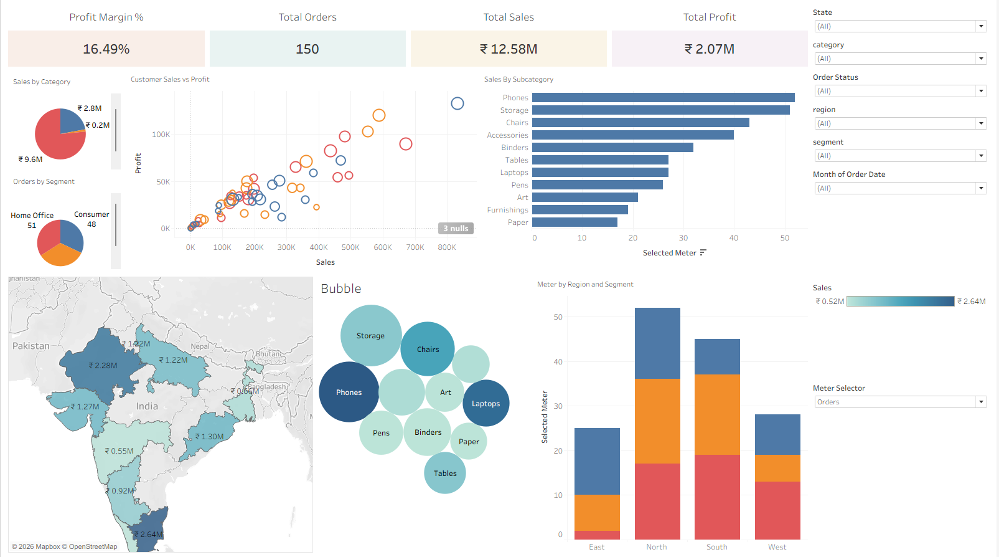
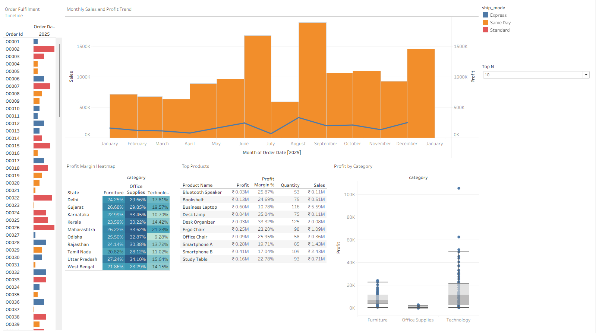

0# OmniCommerce Retail Analytics

End-to-end **PostgreSQL + Tableau** analytics project for retail sales, profit, customer, product, geography, and fulfilment analysis.




## Project Objective

Build a simple business analytics project that shows how raw retail data can be stored in PostgreSQL, verified with SQL, and visualised in Tableau for decision-making.

## Tools Used

- PostgreSQL
- SQL
- Tableau
- CSV data files
- HTML portfolio case study

## Database Tables

The project uses 7 relational tables:

- `customers`
- `products`
- `sales_reps`
- `orders`
- `order_items`
- `shipments`

## Dashboard Highlights

- KPI cards for total sales, total profit, total orders, and profit margin
- Sales by category and sub-category
- Customer sales vs profit scatter plot
- Sales by state map
- Orders by segment
- Packed bubble chart by sub-category
- Monthly sales and profit trend
- Order fulfilment timeline
- Profit margin heatmap
- Top products table
- Profit distribution box-and-whisker plot

## SQL Concepts Covered

- Table creation and relationships
- CSV loading using `\copy`
- Joins across multiple tables
- Filtering with `WHERE`
- Grouping and aggregation
- `CASE` logic
- `HAVING`
- Subqueries
- Window functions using `RANK()`, `ROW_NUMBER()`, and `LAG()`

## Tableau Features Used

- KPI cards
- Bar charts
- Pie charts
- Scatter plot
- Map chart
- Packed bubbles
- Dual-axis trend chart
- Heatmap
- Table visual
- Box-and-whisker plot
- Filters and parameters

## Folder Structure

```text
omnicommerce-retail-analytics/
│
├── data/
│   ├── customers.csv
│   ├── products.csv
│   ├── sales_reps.csv
│   ├── orders.csv
│   ├── order_items.csv
│   ├── shipments.csv
│
├── sql/
│   ├── 00_create_tables.sql
│   ├── 01_load_csv_psql.sql
│   └── 02_verification_queries.sql
│
├── assets/
│   ├── dashboard-overview.png
│   └── dashboard-fulfilment.png
│
├── omnicommerce-postgresql-tableau.html
└── README.md
```

## How to Run

1. Create a PostgreSQL database.
2. Run the table creation script:

```bash6
psql -U postgres -d omnicommerce -f sql/00_create_tables.sql
```

3. Load CSV files:

```bash
psql -U postgres -d omnicommerce -f sql/01_load_csv_psql.sql
```

4. Run verification queries:

```bash
psql -U postgres -d omnicommerce -f sql/02_verification_queries.sql
```

5. Connect PostgreSQL data to Tableau and build the dashboard views.

## Key KPIs

- Total Sales: ₹12.58M
- Total Profit: ₹2.07M
- Total Orders: 150
- Profit Margin: 16.49%

## Outcome

This project demonstrates practical business intelligence skills by combining SQL-based data validation with Tableau dashboard storytelling. It is designed as a portfolio project for business analyst and data analyst roles.

## Author

**Abhinav Dhiman**  
[Portfolio](https://dhimanabhinav69.github.io/) | [LinkedIn](https://www.linkedin.com/in/dhimanabhinav/)
